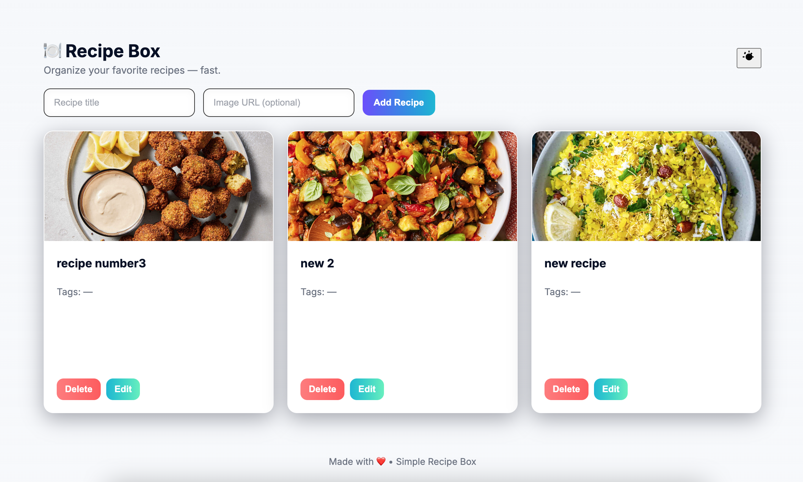

# demo



# Recipe Box

A small Recipe Box app (Express + EJS + Postgres).

Start:

```bash
npm install
node index.js
```

DB schema is in `db/schema.sql` — run it against your Postgres DB before starting.

Quick start for Postgres (macOS / Linux):

1. Ensure Postgres is running locally and you have `createdb` and `psql` available.
2. Run the helper script to create the database and apply the schema:

```bash
npm run init-db
```

If you don't have `createdb`/`psql`, create the DB and run the SQL manually:

```bash
createdb recipe_box
psql -d recipe_box -f db/schema.sql
```
